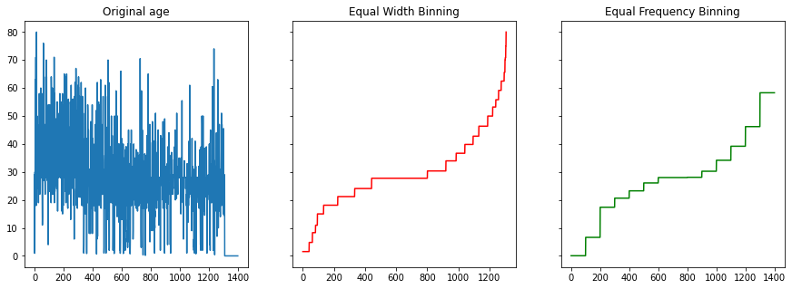
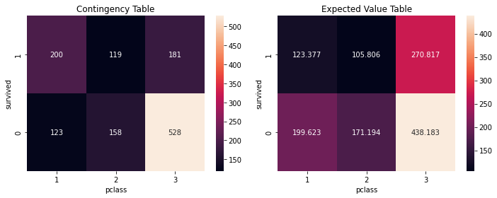
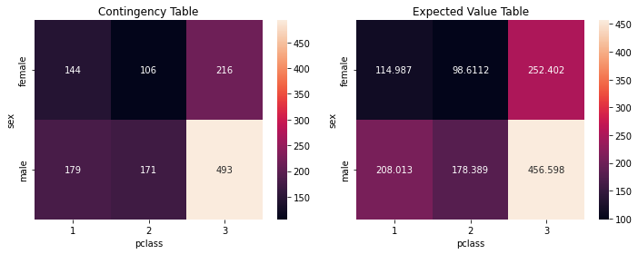
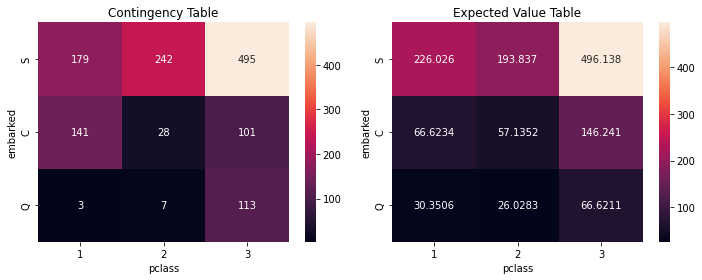
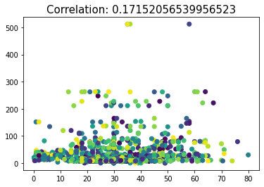
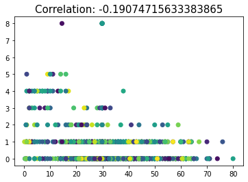

# titanic-data-analysis
Here, I have performed some basic data preprocessing techniques such as filling missing values, binning, chi-square test and correlation analysis

<h3>Import all the required libraries and the data from the excel sheet</h3>


```python
import pandas as pd
import numpy as np
from scipy.stats.distributions import chi2
import matplotlib.pyplot as plt
import seaborn as sns
data = pd.read_excel('titanic.xls')
data
```


<div>
<table border="1" class="dataframe">
  <thead>
    <tr style="text-align: right;">
      <th></th>
      <th>pclass</th>
      <th>survived</th>
      <th>name</th>
      <th>sex</th>
      <th>age</th>
      <th>sibsp</th>
      <th>parch</th>
      <th>ticket</th>
      <th>fare</th>
      <th>embarked</th>
    </tr>
  </thead>
  <tbody>
    <tr>
      <th>0</th>
      <td>1</td>
      <td>1</td>
      <td>Allen, Miss. Elisabeth Walton</td>
      <td>female</td>
      <td>29.0000</td>
      <td>0</td>
      <td>0</td>
      <td>24160</td>
      <td>211.3375</td>
      <td>S</td>
    </tr>
    <tr>
      <th>1</th>
      <td>1</td>
      <td>1</td>
      <td>Allison, Master. Hudson Trevor</td>
      <td>male</td>
      <td>0.9167</td>
      <td>1</td>
      <td>2</td>
      <td>113781</td>
      <td>151.5500</td>
      <td>S</td>
    </tr>
    <tr>
      <th>2</th>
      <td>1</td>
      <td>0</td>
      <td>Allison, Miss. Helen Loraine</td>
      <td>female</td>
      <td>2.0000</td>
      <td>1</td>
      <td>2</td>
      <td>113781</td>
      <td>151.5500</td>
      <td>S</td>
    </tr>
    <tr>
      <th>3</th>
      <td>1</td>
      <td>0</td>
      <td>Allison, Mr. Hudson Joshua Creighton</td>
      <td>male</td>
      <td>30.0000</td>
      <td>1</td>
      <td>2</td>
      <td>113781</td>
      <td>151.5500</td>
      <td>S</td>
    </tr>
    <tr>
      <th>4</th>
      <td>1</td>
      <td>0</td>
      <td>Allison, Mrs. Hudson J C (Bessie Waldo Daniels)</td>
      <td>female</td>
      <td>25.0000</td>
      <td>1</td>
      <td>2</td>
      <td>113781</td>
      <td>151.5500</td>
      <td>S</td>
    </tr>
    <tr>
      <th>...</th>
      <td>...</td>
      <td>...</td>
      <td>...</td>
      <td>...</td>
      <td>...</td>
      <td>...</td>
      <td>...</td>
      <td>...</td>
      <td>...</td>
      <td>...</td>
    </tr>
    <tr>
      <th>1304</th>
      <td>3</td>
      <td>0</td>
      <td>Zabour, Miss. Hileni</td>
      <td>female</td>
      <td>14.5000</td>
      <td>1</td>
      <td>0</td>
      <td>2665</td>
      <td>14.4542</td>
      <td>C</td>
    </tr>
    <tr>
      <th>1305</th>
      <td>3</td>
      <td>0</td>
      <td>Zabour, Miss. Thamine</td>
      <td>female</td>
      <td>NaN</td>
      <td>1</td>
      <td>0</td>
      <td>2665</td>
      <td>14.4542</td>
      <td>C</td>
    </tr>
    <tr>
      <th>1306</th>
      <td>3</td>
      <td>0</td>
      <td>Zakarian, Mr. Mapriededer</td>
      <td>male</td>
      <td>26.5000</td>
      <td>0</td>
      <td>0</td>
      <td>2656</td>
      <td>7.2250</td>
      <td>C</td>
    </tr>
    <tr>
      <th>1307</th>
      <td>3</td>
      <td>0</td>
      <td>Zakarian, Mr. Ortin</td>
      <td>male</td>
      <td>27.0000</td>
      <td>0</td>
      <td>0</td>
      <td>2670</td>
      <td>7.2250</td>
      <td>C</td>
    </tr>
    <tr>
      <th>1308</th>
      <td>3</td>
      <td>0</td>
      <td>Zimmerman, Mr. Leo</td>
      <td>male</td>
      <td>29.0000</td>
      <td>0</td>
      <td>0</td>
      <td>315082</td>
      <td>7.8750</td>
      <td>S</td>
    </tr>
  </tbody>
</table>
<p>1309 rows × 10 columns</p>
</div>


<h3>Q1: a) Count missing values in each column</h3>


```python
def countMissing(data):
    ret = []
    for col in data.columns:
        nulls = 0
        for val in data[col].tolist():
            if pd.isnull(val):
                nulls += 1
        ret.append(nulls)
    return pd.DataFrame(ret, index=data.columns, columns=['nulls'])

countMissing(data)
```


<div>
<table border="1" class="dataframe">
  <thead>
    <tr style="text-align: right;">
      <th></th>
      <th>nulls</th>
    </tr>
  </thead>
  <tbody>
    <tr>
      <th>pclass</th>
      <td>0</td>
    </tr>
    <tr>
      <th>survived</th>
      <td>0</td>
    </tr>
    <tr>
      <th>name</th>
      <td>0</td>
    </tr>
    <tr>
      <th>sex</th>
      <td>0</td>
    </tr>
    <tr>
      <th>age</th>
      <td>263</td>
    </tr>
    <tr>
      <th>sibsp</th>
      <td>0</td>
    </tr>
    <tr>
      <th>parch</th>
      <td>0</td>
    </tr>
    <tr>
      <th>ticket</th>
      <td>0</td>
    </tr>
    <tr>
      <th>fare</th>
      <td>1</td>
    </tr>
    <tr>
      <th>embarked</th>
      <td>2</td>
    </tr>
  </tbody>
</table>
</div>


<h3>Q1: b) Remove rows/attributes having missing values and calculate the ratio with respect to original data</h3>

<h4>Part 1: When removing Columns with missing data:</h4>


```python
def removeRows(data):
    nul = []
    for col in data.columns:
        for val in data[col].tolist():
            if pd.isnull(val):
                nul.append(col)
                break
    data_copy = data.copy()
    for r in nul:
        data_copy = data_copy.drop(r, axis=1)
    # print ratio of removed columns
    print("Ratio of wrt to original data, when attributes are dropped:", len(data_copy.columns)/len(data.columns))
    return data_copy
removeRows(data)
```

    Ratio of wrt to original data, when attributes are dropped: 0.7
    


<div>
<table border="1" class="dataframe">
  <thead>
    <tr style="text-align: right;">
      <th></th>
      <th>pclass</th>
      <th>survived</th>
      <th>name</th>
      <th>sex</th>
      <th>sibsp</th>
      <th>parch</th>
      <th>ticket</th>
    </tr>
  </thead>
  <tbody>
    <tr>
      <th>0</th>
      <td>1</td>
      <td>1</td>
      <td>Allen, Miss. Elisabeth Walton</td>
      <td>female</td>
      <td>0</td>
      <td>0</td>
      <td>24160</td>
    </tr>
    <tr>
      <th>1</th>
      <td>1</td>
      <td>1</td>
      <td>Allison, Master. Hudson Trevor</td>
      <td>male</td>
      <td>1</td>
      <td>2</td>
      <td>113781</td>
    </tr>
    <tr>
      <th>2</th>
      <td>1</td>
      <td>0</td>
      <td>Allison, Miss. Helen Loraine</td>
      <td>female</td>
      <td>1</td>
      <td>2</td>
      <td>113781</td>
    </tr>
    <tr>
      <th>3</th>
      <td>1</td>
      <td>0</td>
      <td>Allison, Mr. Hudson Joshua Creighton</td>
      <td>male</td>
      <td>1</td>
      <td>2</td>
      <td>113781</td>
    </tr>
    <tr>
      <th>4</th>
      <td>1</td>
      <td>0</td>
      <td>Allison, Mrs. Hudson J C (Bessie Waldo Daniels)</td>
      <td>female</td>
      <td>1</td>
      <td>2</td>
      <td>113781</td>
    </tr>
    <tr>
      <th>...</th>
      <td>...</td>
      <td>...</td>
      <td>...</td>
      <td>...</td>
      <td>...</td>
      <td>...</td>
      <td>...</td>
    </tr>
    <tr>
      <th>1304</th>
      <td>3</td>
      <td>0</td>
      <td>Zabour, Miss. Hileni</td>
      <td>female</td>
      <td>1</td>
      <td>0</td>
      <td>2665</td>
    </tr>
    <tr>
      <th>1305</th>
      <td>3</td>
      <td>0</td>
      <td>Zabour, Miss. Thamine</td>
      <td>female</td>
      <td>1</td>
      <td>0</td>
      <td>2665</td>
    </tr>
    <tr>
      <th>1306</th>
      <td>3</td>
      <td>0</td>
      <td>Zakarian, Mr. Mapriededer</td>
      <td>male</td>
      <td>0</td>
      <td>0</td>
      <td>2656</td>
    </tr>
    <tr>
      <th>1307</th>
      <td>3</td>
      <td>0</td>
      <td>Zakarian, Mr. Ortin</td>
      <td>male</td>
      <td>0</td>
      <td>0</td>
      <td>2670</td>
    </tr>
    <tr>
      <th>1308</th>
      <td>3</td>
      <td>0</td>
      <td>Zimmerman, Mr. Leo</td>
      <td>male</td>
      <td>0</td>
      <td>0</td>
      <td>315082</td>
    </tr>
  </tbody>
</table>
<p>1309 rows × 7 columns</p>
</div>


<h4>Part 2: When removing Rows with missing data:</h4>


```python
def removeCols(data):
    nul = []
    for row in data.itertuples():
        for val in list(row)[1:]:
            if pd.isnull(val):
                nul.append(row[0])
                break
    data_copy = data.copy()
    for r in nul:
        data_copy = data_copy.drop(r, axis=0)
    # print ratio of removed rows
    print("Ratio of wrt to original data, when rows are dropped:", len(data_copy.index)/len(data.index))
    return data_copy
removeCols(data)
```

    Ratio of wrt to original data, when rows are dropped: 0.7967914438502673
    


<div>
<table border="1" class="dataframe">
  <thead>
    <tr style="text-align: right;">
      <th></th>
      <th>pclass</th>
      <th>survived</th>
      <th>name</th>
      <th>sex</th>
      <th>age</th>
      <th>sibsp</th>
      <th>parch</th>
      <th>ticket</th>
      <th>fare</th>
      <th>embarked</th>
    </tr>
  </thead>
  <tbody>
    <tr>
      <th>0</th>
      <td>1</td>
      <td>1</td>
      <td>Allen, Miss. Elisabeth Walton</td>
      <td>female</td>
      <td>29.0000</td>
      <td>0</td>
      <td>0</td>
      <td>24160</td>
      <td>211.3375</td>
      <td>S</td>
    </tr>
    <tr>
      <th>1</th>
      <td>1</td>
      <td>1</td>
      <td>Allison, Master. Hudson Trevor</td>
      <td>male</td>
      <td>0.9167</td>
      <td>1</td>
      <td>2</td>
      <td>113781</td>
      <td>151.5500</td>
      <td>S</td>
    </tr>
    <tr>
      <th>2</th>
      <td>1</td>
      <td>0</td>
      <td>Allison, Miss. Helen Loraine</td>
      <td>female</td>
      <td>2.0000</td>
      <td>1</td>
      <td>2</td>
      <td>113781</td>
      <td>151.5500</td>
      <td>S</td>
    </tr>
    <tr>
      <th>3</th>
      <td>1</td>
      <td>0</td>
      <td>Allison, Mr. Hudson Joshua Creighton</td>
      <td>male</td>
      <td>30.0000</td>
      <td>1</td>
      <td>2</td>
      <td>113781</td>
      <td>151.5500</td>
      <td>S</td>
    </tr>
    <tr>
      <th>4</th>
      <td>1</td>
      <td>0</td>
      <td>Allison, Mrs. Hudson J C (Bessie Waldo Daniels)</td>
      <td>female</td>
      <td>25.0000</td>
      <td>1</td>
      <td>2</td>
      <td>113781</td>
      <td>151.5500</td>
      <td>S</td>
    </tr>
    <tr>
      <th>...</th>
      <td>...</td>
      <td>...</td>
      <td>...</td>
      <td>...</td>
      <td>...</td>
      <td>...</td>
      <td>...</td>
      <td>...</td>
      <td>...</td>
      <td>...</td>
    </tr>
    <tr>
      <th>1301</th>
      <td>3</td>
      <td>0</td>
      <td>Youseff, Mr. Gerious</td>
      <td>male</td>
      <td>45.5000</td>
      <td>0</td>
      <td>0</td>
      <td>2628</td>
      <td>7.2250</td>
      <td>C</td>
    </tr>
    <tr>
      <th>1304</th>
      <td>3</td>
      <td>0</td>
      <td>Zabour, Miss. Hileni</td>
      <td>female</td>
      <td>14.5000</td>
      <td>1</td>
      <td>0</td>
      <td>2665</td>
      <td>14.4542</td>
      <td>C</td>
    </tr>
    <tr>
      <th>1306</th>
      <td>3</td>
      <td>0</td>
      <td>Zakarian, Mr. Mapriededer</td>
      <td>male</td>
      <td>26.5000</td>
      <td>0</td>
      <td>0</td>
      <td>2656</td>
      <td>7.2250</td>
      <td>C</td>
    </tr>
    <tr>
      <th>1307</th>
      <td>3</td>
      <td>0</td>
      <td>Zakarian, Mr. Ortin</td>
      <td>male</td>
      <td>27.0000</td>
      <td>0</td>
      <td>0</td>
      <td>2670</td>
      <td>7.2250</td>
      <td>C</td>
    </tr>
    <tr>
      <th>1308</th>
      <td>3</td>
      <td>0</td>
      <td>Zimmerman, Mr. Leo</td>
      <td>male</td>
      <td>29.0000</td>
      <td>0</td>
      <td>0</td>
      <td>315082</td>
      <td>7.8750</td>
      <td>S</td>
    </tr>
  </tbody>
</table>
<p>1043 rows × 10 columns</p>
</div>


<h3>Q1: c) Replace missing values (in original file) of age attribute with:</h3>
<ul>
<li>Mean</li>
<li>Median</li>
</ul>


> lets make a generic function which can perform replacing data effectively.


```python
def replace(df, col, property):
    df['filled-'+col] = df[col].fillna(getattr(data[col], property)())
    return df

data = replace(data, 'age', 'mean')
data
```


<div>
<table border="1" class="dataframe">
  <thead>
    <tr style="text-align: right;">
      <th></th>
      <th>pclass</th>
      <th>survived</th>
      <th>name</th>
      <th>sex</th>
      <th>age</th>
      <th>sibsp</th>
      <th>parch</th>
      <th>ticket</th>
      <th>fare</th>
      <th>embarked</th>
      <th>filled-age</th>
    </tr>
  </thead>
  <tbody>
    <tr>
      <th>0</th>
      <td>1</td>
      <td>1</td>
      <td>Allen, Miss. Elisabeth Walton</td>
      <td>female</td>
      <td>29.0000</td>
      <td>0</td>
      <td>0</td>
      <td>24160</td>
      <td>211.3375</td>
      <td>S</td>
      <td>29.000000</td>
    </tr>
    <tr>
      <th>1</th>
      <td>1</td>
      <td>1</td>
      <td>Allison, Master. Hudson Trevor</td>
      <td>male</td>
      <td>0.9167</td>
      <td>1</td>
      <td>2</td>
      <td>113781</td>
      <td>151.5500</td>
      <td>S</td>
      <td>0.916700</td>
    </tr>
    <tr>
      <th>2</th>
      <td>1</td>
      <td>0</td>
      <td>Allison, Miss. Helen Loraine</td>
      <td>female</td>
      <td>2.0000</td>
      <td>1</td>
      <td>2</td>
      <td>113781</td>
      <td>151.5500</td>
      <td>S</td>
      <td>2.000000</td>
    </tr>
    <tr>
      <th>3</th>
      <td>1</td>
      <td>0</td>
      <td>Allison, Mr. Hudson Joshua Creighton</td>
      <td>male</td>
      <td>30.0000</td>
      <td>1</td>
      <td>2</td>
      <td>113781</td>
      <td>151.5500</td>
      <td>S</td>
      <td>30.000000</td>
    </tr>
    <tr>
      <th>4</th>
      <td>1</td>
      <td>0</td>
      <td>Allison, Mrs. Hudson J C (Bessie Waldo Daniels)</td>
      <td>female</td>
      <td>25.0000</td>
      <td>1</td>
      <td>2</td>
      <td>113781</td>
      <td>151.5500</td>
      <td>S</td>
      <td>25.000000</td>
    </tr>
    <tr>
      <th>...</th>
      <td>...</td>
      <td>...</td>
      <td>...</td>
      <td>...</td>
      <td>...</td>
      <td>...</td>
      <td>...</td>
      <td>...</td>
      <td>...</td>
      <td>...</td>
      <td>...</td>
    </tr>
    <tr>
      <th>1304</th>
      <td>3</td>
      <td>0</td>
      <td>Zabour, Miss. Hileni</td>
      <td>female</td>
      <td>14.5000</td>
      <td>1</td>
      <td>0</td>
      <td>2665</td>
      <td>14.4542</td>
      <td>C</td>
      <td>14.500000</td>
    </tr>
    <tr>
      <th>1305</th>
      <td>3</td>
      <td>0</td>
      <td>Zabour, Miss. Thamine</td>
      <td>female</td>
      <td>NaN</td>
      <td>1</td>
      <td>0</td>
      <td>2665</td>
      <td>14.4542</td>
      <td>C</td>
      <td>29.881135</td>
    </tr>
    <tr>
      <th>1306</th>
      <td>3</td>
      <td>0</td>
      <td>Zakarian, Mr. Mapriededer</td>
      <td>male</td>
      <td>26.5000</td>
      <td>0</td>
      <td>0</td>
      <td>2656</td>
      <td>7.2250</td>
      <td>C</td>
      <td>26.500000</td>
    </tr>
    <tr>
      <th>1307</th>
      <td>3</td>
      <td>0</td>
      <td>Zakarian, Mr. Ortin</td>
      <td>male</td>
      <td>27.0000</td>
      <td>0</td>
      <td>0</td>
      <td>2670</td>
      <td>7.2250</td>
      <td>C</td>
      <td>27.000000</td>
    </tr>
    <tr>
      <th>1308</th>
      <td>3</td>
      <td>0</td>
      <td>Zimmerman, Mr. Leo</td>
      <td>male</td>
      <td>29.0000</td>
      <td>0</td>
      <td>0</td>
      <td>315082</td>
      <td>7.8750</td>
      <td>S</td>
      <td>29.000000</td>
    </tr>
  </tbody>
</table>
<p>1309 rows × 11 columns</p>
</div>


```python
replace(data, 'age', 'median')
```


<div>
<table border="1" class="dataframe">
  <thead>
    <tr style="text-align: right;">
      <th></th>
      <th>pclass</th>
      <th>survived</th>
      <th>name</th>
      <th>sex</th>
      <th>age</th>
      <th>sibsp</th>
      <th>parch</th>
      <th>ticket</th>
      <th>fare</th>
      <th>embarked</th>
      <th>filled-age</th>
    </tr>
  </thead>
  <tbody>
    <tr>
      <th>0</th>
      <td>1</td>
      <td>1</td>
      <td>Allen, Miss. Elisabeth Walton</td>
      <td>female</td>
      <td>29.0000</td>
      <td>0</td>
      <td>0</td>
      <td>24160</td>
      <td>211.3375</td>
      <td>S</td>
      <td>29.0000</td>
    </tr>
    <tr>
      <th>1</th>
      <td>1</td>
      <td>1</td>
      <td>Allison, Master. Hudson Trevor</td>
      <td>male</td>
      <td>0.9167</td>
      <td>1</td>
      <td>2</td>
      <td>113781</td>
      <td>151.5500</td>
      <td>S</td>
      <td>0.9167</td>
    </tr>
    <tr>
      <th>2</th>
      <td>1</td>
      <td>0</td>
      <td>Allison, Miss. Helen Loraine</td>
      <td>female</td>
      <td>2.0000</td>
      <td>1</td>
      <td>2</td>
      <td>113781</td>
      <td>151.5500</td>
      <td>S</td>
      <td>2.0000</td>
    </tr>
    <tr>
      <th>3</th>
      <td>1</td>
      <td>0</td>
      <td>Allison, Mr. Hudson Joshua Creighton</td>
      <td>male</td>
      <td>30.0000</td>
      <td>1</td>
      <td>2</td>
      <td>113781</td>
      <td>151.5500</td>
      <td>S</td>
      <td>30.0000</td>
    </tr>
    <tr>
      <th>4</th>
      <td>1</td>
      <td>0</td>
      <td>Allison, Mrs. Hudson J C (Bessie Waldo Daniels)</td>
      <td>female</td>
      <td>25.0000</td>
      <td>1</td>
      <td>2</td>
      <td>113781</td>
      <td>151.5500</td>
      <td>S</td>
      <td>25.0000</td>
    </tr>
    <tr>
      <th>...</th>
      <td>...</td>
      <td>...</td>
      <td>...</td>
      <td>...</td>
      <td>...</td>
      <td>...</td>
      <td>...</td>
      <td>...</td>
      <td>...</td>
      <td>...</td>
      <td>...</td>
    </tr>
    <tr>
      <th>1304</th>
      <td>3</td>
      <td>0</td>
      <td>Zabour, Miss. Hileni</td>
      <td>female</td>
      <td>14.5000</td>
      <td>1</td>
      <td>0</td>
      <td>2665</td>
      <td>14.4542</td>
      <td>C</td>
      <td>14.5000</td>
    </tr>
    <tr>
      <th>1305</th>
      <td>3</td>
      <td>0</td>
      <td>Zabour, Miss. Thamine</td>
      <td>female</td>
      <td>NaN</td>
      <td>1</td>
      <td>0</td>
      <td>2665</td>
      <td>14.4542</td>
      <td>C</td>
      <td>28.0000</td>
    </tr>
    <tr>
      <th>1306</th>
      <td>3</td>
      <td>0</td>
      <td>Zakarian, Mr. Mapriededer</td>
      <td>male</td>
      <td>26.5000</td>
      <td>0</td>
      <td>0</td>
      <td>2656</td>
      <td>7.2250</td>
      <td>C</td>
      <td>26.5000</td>
    </tr>
    <tr>
      <th>1307</th>
      <td>3</td>
      <td>0</td>
      <td>Zakarian, Mr. Ortin</td>
      <td>male</td>
      <td>27.0000</td>
      <td>0</td>
      <td>0</td>
      <td>2670</td>
      <td>7.2250</td>
      <td>C</td>
      <td>27.0000</td>
    </tr>
    <tr>
      <th>1308</th>
      <td>3</td>
      <td>0</td>
      <td>Zimmerman, Mr. Leo</td>
      <td>male</td>
      <td>29.0000</td>
      <td>0</td>
      <td>0</td>
      <td>315082</td>
      <td>7.8750</td>
      <td>S</td>
      <td>29.0000</td>
    </tr>
  </tbody>
</table>
<p>1309 rows × 11 columns</p>
</div>


<h3>Q2: WAP to perform transformation of data on age attribute of Titanic dataset using Binning </h3>
<h4> a) With equal width bins using K=25, using mean (you may fill zero value to balance last bin)
<br> b) With equal frequency bins of size 100 using mean (you may fill zero value to balance last bin) </h4>


```python
def binningEqualWidth(age, k):
    a = len(age)
    w = (max(age) - min(age))/k
    bins = [min(age) + i*w for i in range(k+1)]
    ret = []
    for i in range(0, k):
        curr = []
        for j in age:
            if j >= bins[i] and j <= bins[i+1]:
                curr.append(j)
        # mean of curr
        ret+=[np.mean(curr)]*len(curr)
    return ret


def binningEqualFrequency(age, size):
    while len(age) % size != 0:
        age.append(0)
    age = sorted(age)
    ret = []
    for i in range(0, len(age), size):
        ret+=[np.mean(age[i:i+size])]*size
    return ret

def binning(li):
    equalWidth = binningEqualWidth(li, 25)
    equalFrequency = binningEqualFrequency(li, 100)
    fig, axs = plt.subplots(1,3, figsize=(15,5), sharey=True)
    axs[0].plot(li, label = 'Original age')
    axs[0].set_title('Original age')
    axs[1].plot(equalWidth, label = 'Equal Width Binning', color = 'red')
    axs[1].set_title('Equal Width Binning')
    axs[2].plot(equalFrequency, label = 'Equal Frequency Binning', color = 'green')
    axs[2].set_title('Equal Frequency Binning')
    plt.show()

binning(data['filled-age'].tolist())

```


    

    


<h3>Q3: Perform chi-square test (also show the contingency table) </h3>
<h4> a) Pclass & Survived (fill missing values with highest frequency category, if any) <br>
 b) Pclass & sex (fill missing values with highest frequency category, if any) <br>
 c) Plass & embarked (fill missing values with highest frequency category, if any) </h4>


```python
def chiSquareCalc(x, y):
    x = x.fillna(x.mode()[0])
    y = y.fillna(y.mode()[0])
    
    table = {}
    for i in range(len(x)):
        if x[i] in table:
            if y[i] in table[x[i]]:
                table[x[i]][y[i]] += 1
            else:
                table[x[i]][y[i]] = 1
        else:
            table[x[i]] = {}
            table[x[i]][y[i]] = 1
    df = pd.DataFrame(table)
    df['Sum(row)'] = df.sum(axis=1)
    df.loc['Sum(col)'] = df.sum()
    df.columns.name = x.name
    df.index.name = y.name

    df_exp = df.copy()

    for i in range(len(df.columns)-1):
        df_exp.iloc[i, :-1] = df_exp.iloc[-1,:-1]*df_exp.iloc[i, -1]/df_exp.iloc[-1,-1]

    # Plot everything
    plt.figure(figsize=(10,4))
    plt.subplot(1,2,1)
    sns.heatmap(df.iloc[:-1, :-1], annot=True, fmt='d')
    plt.title('Contingency Table')
    plt.subplot(1,2,2)
    sns.heatmap(df_exp.iloc[:-1, :-1], annot=True, fmt='g')
    plt.title('Expected Value Table')
    plt.tight_layout()
    plt.show()

    chiSq = np.sum(np.sum(((df.iloc[:-1, :-1] - df_exp.iloc[:-1, :-1])**2/df_exp.iloc[:-1, :-1])))
    print("The chi-square value:", chiSq)
    rows = x.unique()
    cols = y.unique()
    dof = (len(rows)-1)*(len(cols)-1)
    print("The degree of freedom:", dof)
    p = chi2.sf(chiSq, dof)
    print("The p-value:", p)


chiSquareCalc(data['pclass'], data['survived'])
```


    

    


    The chi-square value: 127.85915643930326
    The degree of freedom: 2
    The p-value: 1.7208259588256175e-28
    


```python
chiSquareCalc(data['pclass'], data['sex'])
```


    

    


    The chi-square value: 20.378781205085584
    The degree of freedom: 2
    The p-value: 3.7566772719164106e-05
    


```python
chiSquareCalc(data['pclass'], data['embarked'])
```


    

    


    The chi-square value: 204.48431967559742
    The degree of freedom: 4
    The p-value: 4.0799162291284984e-43
    

<h3>Q4: Perform correlation analysis</h3>
<h4> a) Age & Fare (first fill missing values using mean, if any) <br> 
b) Age & sibsp (first fill missing values using mean, if any) </h4>


```python
def correlation(x, y):
    x = x.fillna(x.mean())
    y = y.fillna(y.mean())

    r = ((x-x.mean())*(y-y.mean())).sum() / ((x.size-1)*x.std()*y.std())
    plt.scatter(x, y, c=np.random.rand(x.size))
    plt.title("Correlation: "+str(r), fontsize=15)
    plt.show()
```


```python
correlation(data['age'], data['fare'])
```


    

    


```python
correlation(data['age'], data['sibsp'])
```


    

    


Thank You
