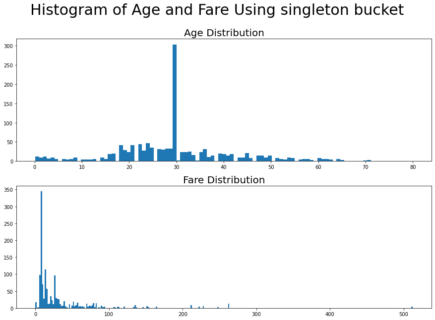
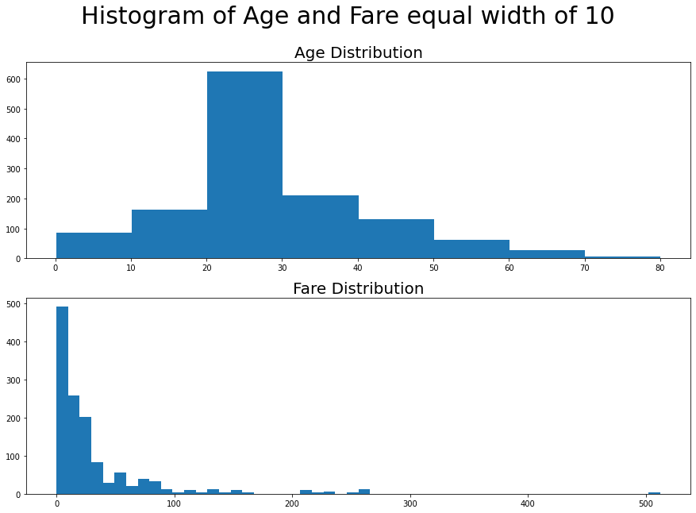
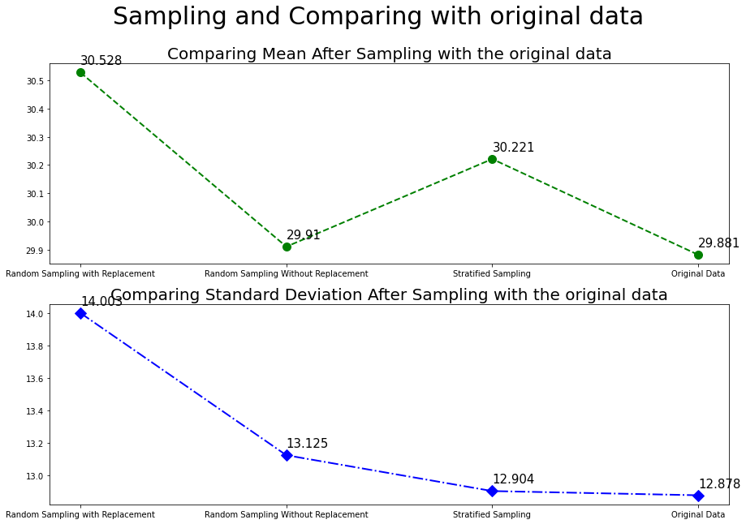
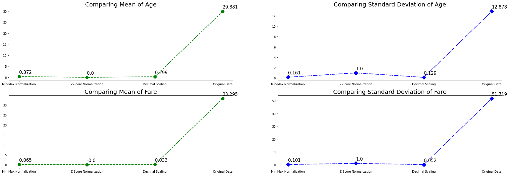

# titanic-data-analysis
Here, I have performed some basic data preprocessing techniques such as filling missing values, creating histograms, sampling methods implementation and normalizartion techniques implementation.
This is part of the DWDM assignment 5.

### Import all the required libraries and the data from the excel sheet


```python
import pandas as pd
import numpy as np
import matplotlib.pyplot as plt
import secrets
import math
data = pd.read_excel('titanic.xls')
data
```


<div>
<table border="1" class="dataframe">
  <thead>
    <tr style="text-align: right;">
      <th></th>
      <th>pclass</th>
      <th>survived</th>
      <th>name</th>
      <th>sex</th>
      <th>age</th>
      <th>sibsp</th>
      <th>parch</th>
      <th>ticket</th>
      <th>fare</th>
      <th>embarked</th>
    </tr>
  </thead>
  <tbody>
    <tr>
      <th>0</th>
      <td>1</td>
      <td>1</td>
      <td>Allen, Miss. Elisabeth Walton</td>
      <td>female</td>
      <td>29.0000</td>
      <td>0</td>
      <td>0</td>
      <td>24160</td>
      <td>211.3375</td>
      <td>S</td>
    </tr>
    <tr>
      <th>1</th>
      <td>1</td>
      <td>1</td>
      <td>Allison, Master. Hudson Trevor</td>
      <td>male</td>
      <td>0.9167</td>
      <td>1</td>
      <td>2</td>
      <td>113781</td>
      <td>151.5500</td>
      <td>S</td>
    </tr>
    <tr>
      <th>2</th>
      <td>1</td>
      <td>0</td>
      <td>Allison, Miss. Helen Loraine</td>
      <td>female</td>
      <td>2.0000</td>
      <td>1</td>
      <td>2</td>
      <td>113781</td>
      <td>151.5500</td>
      <td>S</td>
    </tr>
    <tr>
      <th>3</th>
      <td>1</td>
      <td>0</td>
      <td>Allison, Mr. Hudson Joshua Creighton</td>
      <td>male</td>
      <td>30.0000</td>
      <td>1</td>
      <td>2</td>
      <td>113781</td>
      <td>151.5500</td>
      <td>S</td>
    </tr>
    <tr>
      <th>4</th>
      <td>1</td>
      <td>0</td>
      <td>Allison, Mrs. Hudson J C (Bessie Waldo Daniels)</td>
      <td>female</td>
      <td>25.0000</td>
      <td>1</td>
      <td>2</td>
      <td>113781</td>
      <td>151.5500</td>
      <td>S</td>
    </tr>
    <tr>
      <th>...</th>
      <td>...</td>
      <td>...</td>
      <td>...</td>
      <td>...</td>
      <td>...</td>
      <td>...</td>
      <td>...</td>
      <td>...</td>
      <td>...</td>
      <td>...</td>
    </tr>
    <tr>
      <th>1304</th>
      <td>3</td>
      <td>0</td>
      <td>Zabour, Miss. Hileni</td>
      <td>female</td>
      <td>14.5000</td>
      <td>1</td>
      <td>0</td>
      <td>2665</td>
      <td>14.4542</td>
      <td>C</td>
    </tr>
    <tr>
      <th>1305</th>
      <td>3</td>
      <td>0</td>
      <td>Zabour, Miss. Thamine</td>
      <td>female</td>
      <td>NaN</td>
      <td>1</td>
      <td>0</td>
      <td>2665</td>
      <td>14.4542</td>
      <td>C</td>
    </tr>
    <tr>
      <th>1306</th>
      <td>3</td>
      <td>0</td>
      <td>Zakarian, Mr. Mapriededer</td>
      <td>male</td>
      <td>26.5000</td>
      <td>0</td>
      <td>0</td>
      <td>2656</td>
      <td>7.2250</td>
      <td>C</td>
    </tr>
    <tr>
      <th>1307</th>
      <td>3</td>
      <td>0</td>
      <td>Zakarian, Mr. Ortin</td>
      <td>male</td>
      <td>27.0000</td>
      <td>0</td>
      <td>0</td>
      <td>2670</td>
      <td>7.2250</td>
      <td>C</td>
    </tr>
    <tr>
      <th>1308</th>
      <td>3</td>
      <td>0</td>
      <td>Zimmerman, Mr. Leo</td>
      <td>male</td>
      <td>29.0000</td>
      <td>0</td>
      <td>0</td>
      <td>315082</td>
      <td>7.8750</td>
      <td>S</td>
    </tr>
  </tbody>
</table>
<p>1309 rows × 10 columns</p>
</div>


### *First of all fill all missing values in Age and Fare with mean values

> lets use a generic function which can perform replacing data effectively.


```python
data['age'].fillna(data['age'].mean(), inplace=True)
data['fare'].fillna(data['fare'].mean(), inplace=True)
data
```


<div>
<table border="1" class="dataframe">
  <thead>
    <tr style="text-align: right;">
      <th></th>
      <th>pclass</th>
      <th>survived</th>
      <th>name</th>
      <th>sex</th>
      <th>age</th>
      <th>sibsp</th>
      <th>parch</th>
      <th>ticket</th>
      <th>fare</th>
      <th>embarked</th>
    </tr>
  </thead>
  <tbody>
    <tr>
      <th>0</th>
      <td>1</td>
      <td>1</td>
      <td>Allen, Miss. Elisabeth Walton</td>
      <td>female</td>
      <td>29.000000</td>
      <td>0</td>
      <td>0</td>
      <td>24160</td>
      <td>211.3375</td>
      <td>S</td>
    </tr>
    <tr>
      <th>1</th>
      <td>1</td>
      <td>1</td>
      <td>Allison, Master. Hudson Trevor</td>
      <td>male</td>
      <td>0.916700</td>
      <td>1</td>
      <td>2</td>
      <td>113781</td>
      <td>151.5500</td>
      <td>S</td>
    </tr>
    <tr>
      <th>2</th>
      <td>1</td>
      <td>0</td>
      <td>Allison, Miss. Helen Loraine</td>
      <td>female</td>
      <td>2.000000</td>
      <td>1</td>
      <td>2</td>
      <td>113781</td>
      <td>151.5500</td>
      <td>S</td>
    </tr>
    <tr>
      <th>3</th>
      <td>1</td>
      <td>0</td>
      <td>Allison, Mr. Hudson Joshua Creighton</td>
      <td>male</td>
      <td>30.000000</td>
      <td>1</td>
      <td>2</td>
      <td>113781</td>
      <td>151.5500</td>
      <td>S</td>
    </tr>
    <tr>
      <th>4</th>
      <td>1</td>
      <td>0</td>
      <td>Allison, Mrs. Hudson J C (Bessie Waldo Daniels)</td>
      <td>female</td>
      <td>25.000000</td>
      <td>1</td>
      <td>2</td>
      <td>113781</td>
      <td>151.5500</td>
      <td>S</td>
    </tr>
    <tr>
      <th>...</th>
      <td>...</td>
      <td>...</td>
      <td>...</td>
      <td>...</td>
      <td>...</td>
      <td>...</td>
      <td>...</td>
      <td>...</td>
      <td>...</td>
      <td>...</td>
    </tr>
    <tr>
      <th>1304</th>
      <td>3</td>
      <td>0</td>
      <td>Zabour, Miss. Hileni</td>
      <td>female</td>
      <td>14.500000</td>
      <td>1</td>
      <td>0</td>
      <td>2665</td>
      <td>14.4542</td>
      <td>C</td>
    </tr>
    <tr>
      <th>1305</th>
      <td>3</td>
      <td>0</td>
      <td>Zabour, Miss. Thamine</td>
      <td>female</td>
      <td>29.881135</td>
      <td>1</td>
      <td>0</td>
      <td>2665</td>
      <td>14.4542</td>
      <td>C</td>
    </tr>
    <tr>
      <th>1306</th>
      <td>3</td>
      <td>0</td>
      <td>Zakarian, Mr. Mapriededer</td>
      <td>male</td>
      <td>26.500000</td>
      <td>0</td>
      <td>0</td>
      <td>2656</td>
      <td>7.2250</td>
      <td>C</td>
    </tr>
    <tr>
      <th>1307</th>
      <td>3</td>
      <td>0</td>
      <td>Zakarian, Mr. Ortin</td>
      <td>male</td>
      <td>27.000000</td>
      <td>0</td>
      <td>0</td>
      <td>2670</td>
      <td>7.2250</td>
      <td>C</td>
    </tr>
    <tr>
      <th>1308</th>
      <td>3</td>
      <td>0</td>
      <td>Zimmerman, Mr. Leo</td>
      <td>male</td>
      <td>29.000000</td>
      <td>0</td>
      <td>0</td>
      <td>315082</td>
      <td>7.8750</td>
      <td>S</td>
    </tr>
  </tbody>
</table>
<p>1309 rows × 10 columns</p>
</div>


#### Q1. Using the data for **age** and **fare** attribute given in Titanic dataset:
a. WAP to Plot histogram using singleton bucket.<br>
b. WAP to Plot an equal-width histogram of width 10.


```python
fig, axs = plt.subplots(2, figsize=(15,10))
fig.suptitle('Histogram of Age and Fare Using singleton bucket', fontsize=30)
axs[0].hist(data['age'], bins=data.age.nunique())
axs[0].set_title('Age Distribution', fontsize=20)
axs[1].hist(data['fare'], bins=data.fare.nunique())
axs[1].set_title('Fare Distribution', fontsize=20)
plt.show()
```


    

    


```python
fig, axs = plt.subplots(2, figsize=(15,10))
fig.suptitle('Histogram of Age and Fare equal width of 10', fontsize=30)
axs[0].hist(data['age'], bins=math.ceil(data.age.max()/10))
axs[0].set_title('Age Distribution', fontsize=20)
axs[1].hist(data['fare'], bins=math.ceil(data.fare.max()/10))
axs[1].set_title('Fare Distribution', fontsize=20)
plt.show()
```


    

    


#### Q2. Using the data for **age** attribute given in Titanic dataset, WAP to perform sampling techniques (Select 30% samples with the following methods)
a. Simple Random Sampling with Replacement.<br>
b. Simple Random Sampling without Replacement.<br>
c. Stratified Sampling. (use three intervals as per the range of attribute).<br>


```python
def randomSampleReplace(age):
    return [secrets.choice(age) for _ in range(int(len(age)*0.3))]

def randomSampleNoReplace(age):
    sample = set()
    while len(sample) < int(len(age)*0.3):
        sample.add(secrets.randbelow(len(age)))
    return [age[i] for i in sample]

def stratifiedSampling(age):
    interval = len(age)//3
    age.sort()
    sample = randomSampleNoReplace(age[:interval])
    sample.extend(randomSampleNoReplace(age[interval:2*interval]))
    sample.extend(randomSampleNoReplace(age[2*interval:]))
    return sample

replacement = randomSampleReplace(data['age'])
noReplacement = randomSampleNoReplace(data['age'])
stratified = stratifiedSampling(list(data['age']))
```

d. Calculate **mean** and **standard deviation** after sampling and compare it with **mean** and **standard deviation** of the original data.


```python
def meanStdDev(sample):
    mean = sum(sample) / len(sample)
    stdDev = math.sqrt(sum([(x - mean)**2 for x in sample]) / len(sample))
    return [mean, stdDev]

calculations = [meanStdDev(sample) for sample in [replacement, noReplacement, stratified, data.age]]
transposed = np.array(calculations).T.tolist()
labels = ['Random Sampling with Replacement', 'Random Sampling Without Replacement', 'Stratified Sampling', 'Original Data']

fig, axs = plt.subplots(2, figsize=(15,10))
fig.suptitle('Sampling and Comparing with original data', fontsize=30)

axs[0].plot(labels, transposed[0], 'go--', linewidth=2, markersize=10)
axs[0].set_title('Comparing Mean After Sampling with the original data', fontsize=20)

axs[1].plot(labels, transposed[1], 'bD-.', linewidth=2, markersize=10)
axs[1].set_title('Comparing Standard Deviation After Sampling with the original data', fontsize=20)

for x, y in zip(labels, calculations):
    axs[0].annotate(round(y[0],3), (x, y[0]), textcoords='offset points', xytext=(0,10),  size=15)
    axs[1].annotate(round(y[1],3), (x, y[1]), textcoords='offset points', xytext=(0,10),  size=15)
plt.show()
```


    

    


#### Q3. Using the data for **age** and **fare** attribute given in Titanic dataset, 
a. WAP for min-max normalization onto the range [0, 1].<br>
b. WAP for z-score normalization.<br>
c. WAP to perform decimal scaling.<br>
d. Calculate **mean** and **standard deviation** after all types of normalization and compare it with **mean** and **standard deviation** of the original data.


```python
def min_max(arr):
    minn = min(arr)
    maxx = max(arr)
    return [(i - minn)/(maxx - minn)*(1-0)+0 for i in arr]

def z_score(arr):
    mean = sum(arr)/len(arr)
    stdDev = math.sqrt(sum([(x - mean)**2 for x in arr]) / len(arr))
    return [(x - mean)/stdDev for x in arr]

def decimal(arr):
    j =  math.floor(math.log10(max(arr))+1)
    return [x/(10**j) for x in arr]


def plot(fig, axs, arr, title):
    calculations = [meanStdDev(x) for x in [min_max(arr), z_score(arr), decimal(arr), arr]]
    transposed = np.array(calculations).T.tolist()
    labels = ['Min-Max Normalization', 'Z-Score Normalization', 'Decimal Scaling', 'Original Data']

    axs[0].plot(labels, transposed[0], 'go--', linewidth=2, markersize=10)
    axs[0].set_title('Comparing Mean of '+title, fontsize=20)

    axs[1].plot(labels, transposed[1], 'bD-.', linewidth=2, markersize=10)
    axs[1].set_title('Comparing Standard Deviation of '+title, fontsize=20)

    for x, y in zip(labels, calculations):
        axs[0].annotate(round(y[0],3), (x, y[0]), textcoords='offset points', xytext=(0,10),  size=15)
        axs[1].annotate(round(y[1],3), (x, y[1]), textcoords='offset points', xytext=(0,10),  size=15)


fig, axs = plt.subplots(2,2, figsize=(30,10))
plot(fig, axs[0], data.age, 'Age')
plot(fig, axs[1], data.fare, 'Fare')
plt.show()
```


    

    


Thank You
